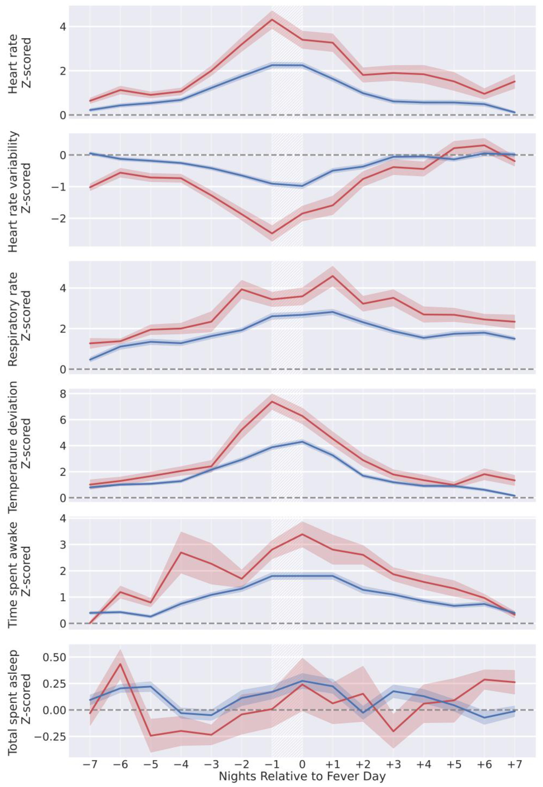

This work aimed to assess the potential of using commercially available wearable devices, specifically the Oura Ring, for syndromic surveillance. We focused on detecting fever as a key indicator of illness. We used Oura Ring data from 63,153 participants (e.g., skin temperature, heart rate, and sleep data) together with daily questionnaires that included information about subjective fever and self-assessed body temperature. We trained a tree-based classifier to classify wearable data as either from fever or non-fever days. Our model performed well, with a AUROC of 0.85 and a false positive rate of 0.8% at a sensitivity of 0.50. These results indicate the feasibility of using wearable data for real-time fever surveillance at a public health level, potentially enhancing the detection and monitoring of disease outbreaks.

