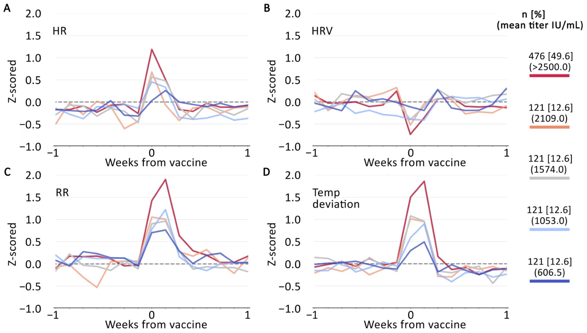

There is significant variability in neutralizing antibody responses (which correlate with immune protection) after COVID-19 vaccination, but only limited information is available about predictors of these responses. We investigated whether device-generated summaries of physiological metrics collected by a wearable device correlated with post-vaccination levels of antibodies to the SARS-CoV-2 receptor-binding domain (RBD), the target of neutralizing antibodies generated by existing COVID-19 vaccines. One thousand, one hundred and seventy-nine participants wore an off-the-shelf wearable device (Oura Ring), reported dates of COVID-19 vaccinations, and completed testing for antibodies to the SARS-CoV-2 RBD during the U.S. COVID-19 vaccination rollout. We found that on the night immediately following the second mRNA injection (Moderna-NIAID and Pfizer-BioNTech) increases in dermal temperature deviation and resting heart rate, and decreases in heart rate variability (a measure of sympathetic nervous system activation) and deep sleep were each statistically significantly correlated with greater RBD antibody responses. These associations were stronger in models using metrics adjusted for the pre-vaccination baseline period. Greater temperature deviation emerged as the strongest independent predictor of greater RBD antibody responses in multivariable models. In contrast to data on certain other vaccines, we did not find clear associations between increased sleep surrounding vaccination and antibody responses.

